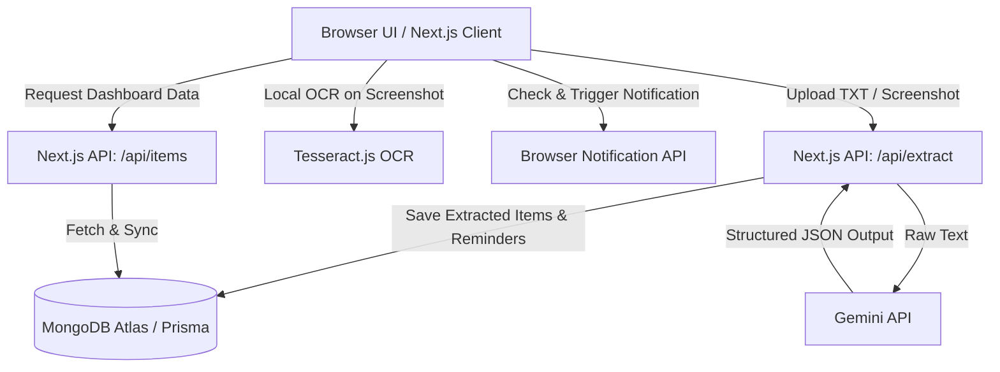
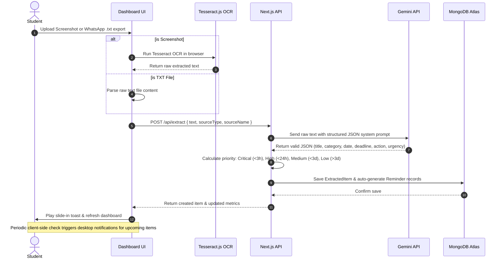

# CampusFlow MVP - Implementation Plan & Architecture

CampusFlow is an AI-powered academic inbox and student assistant that solves information overload for college students. This document details the architectural design and provides the exact phase-by-phase prompts for building the MVP during a 48-hour hackathon.

## A. Final Tech Stack Decision & Justification

To build a robust, beautiful, and demo-ready MVP in 48 hours, we choose the following stack:

*   **Framework**: **Next.js 14/15 (App Router, TypeScript)**
    *   *Why*: Unifies frontend and backend code, eliminating CORS issues, deployment overhead, and setup delay. API routes handle LLM and database actions securely in a single codebase.
*   **Database & ORM**: **MongoDB Atlas + Prisma**
    *   *Why*: MongoDB's document structure is ideal for arbitrary screenshot extracts and flexible task shapes. Prisma provides autocomplete, compile-time safety, and handles relationship queries easily.
*   **AI Engine**: **Gemini 2.5 Flash / Gemini 1.5 Flash (via @google/generative-ai)**
    *   *Why*: Fast responses, large context window (easily handles long WhatsApp exports), free/low-cost tier, and native support for Structured JSON output (Schema mode).
*   **OCR**: **Tesseract.js** (Client-side)
    *   *Why*: Performs text extraction directly in the student's browser. Reduces server load, eliminates file storage complexity on the backend, and provides instant visual feedback during upload.
*   **UI/UX**: **Tailwind CSS + Shadcn/ui + Lucide Icons**
    *   *Why*: Speeds up production-quality UI design with beautiful, pre-built components (Cards, Dialogs, Badges, Toast notifications) matching a premium, modern dashboard aesthetic.

---

## B. Complete Architecture

The system uses a direct client-to-server-to-database layout for speed. Large file processing (OCR) is offloaded to the client browser:



---

## C. Complete User Workflow



---

## D. Folder Structure

```
campusflow/
├── prisma/
│   └── schema.prisma
├── src/
│   ├── app/
│   │   ├── layout.tsx
│   │   ├── page.tsx
│   │   ├── globals.css
│   │   └── api/
│   │       ├── extract/
│   │       │   └── route.ts
│   │       └── items/
│   │           ├── route.ts
│   │           └── [id]/
│   │               └── route.ts
│   ├── components/
│   │   ├── ui/
│   │   │   ├── button.tsx
│   │   │   ├── card.tsx
│   │   │   ├── dialog.tsx
│   │   │   ├── badge.tsx
│   │   │   ├── toast.tsx
│   │   │   └── use-toast.ts
│   │   ├── Dashboard.tsx
│   │   ├── FileUpload.tsx
│   │   ├── ItemCard.tsx
│   │   ├── NotificationManager.tsx
│   │   └── StatCards.tsx
│   ├── lib/
│   │   ├── db.ts
│   │   ├── gemini.ts
│   │   └── utils.ts
│   └── types/
│       └── index.ts
├── .env.local
├── package.json
├── tsconfig.json
├── tailwind.config.ts
└── next.config.ts
```

---

## E. Database Schema (Prisma & MongoDB)

```prisma
datasource db {
  provider = "mongodb"
  url      = env("DATABASE_URL")
}

generator client {
  provider = "prisma-client-js"
}

enum Category {
  ASSIGNMENT
  EXAM
  EVENT
  PLACEMENT
  NOTICE
  OTHER
}

enum Priority {
  CRITICAL
  HIGH
  MEDIUM
  LOW
}

model ExtractedItem {
  id             String     @id @default(auto()) @map("_id") @db.ObjectId
  title          String
  category       Category
  summary        String
  date           String?    // e.g. "2026-06-15"
  time           String?    // e.g. "14:00"
  deadline       DateTime?  // Combined deadline timestamp in UTC
  priority       Priority
  sourceType     String     // "whatsapp" | "screenshot"
  sourceName     String?    // File upload metadata
  actionRequired String?
  isCompleted    Boolean    @default(false)
  createdAt      DateTime   @default(now())
  updatedAt      DateTime   @updatedAt
  reminders      Reminder[]
}

model Reminder {
  id              String        @id @default(auto()) @map("_id") @db.ObjectId
  itemId          String        @db.ObjectId
  item            ExtractedItem @relation(fields: [itemId], references: [id], onDelete: Cascade)
  reminderTime    DateTime      // Time to trigger notification
  isTriggered     Boolean       @default(false)
  isDismissed     Boolean       @default(false)
  createdAt       DateTime      @default(now())
}
```

---

## F. API Routes Reference

### 1. `POST /api/extract`
*   **Description**: Receives raw text, calls Gemini API to extract details, computes priorities, generates reminder dates, and saves models to the database.
*   **Request Body**:
    ```json
    {
      "text": "WhatsApp text contents OR OCR output text",
      "sourceType": "whatsapp" | "screenshot",
      "sourceName": "class_chat.txt"
    }
    ```
*   **Response Body**:
    ```json
    {
      "success": true,
      "data": {
        "id": "647f3b890...",
        "title": "OS Lab Assignment 3",
        "category": "ASSIGNMENT",
        "priority": "HIGH",
        "deadline": "2026-06-14T10:00:00.000Z",
        "summary": "Implement Bankers Algorithm in C. Submit via classroom.",
        "reminders": [ ... ]
      }
    }
    ```

### 2. `GET /api/items`
*   **Description**: Retrieves all academic items sorted by priority and execution deadline.
*   **Response Body**:
    ```json
    {
      "success": true,
      "data": [
        {
          "id": "...",
          "title": "...",
          "category": "...",
          "priority": "..."
        }
      ]
    }
    ```

### 3. `PUT /api/items/[id]`
*   **Description**: Updates task status (e.g., mark complete or dismiss reminder).
*   **Request Body**:
    ```json
    {
      "isCompleted": true
    }
    ```
*   **Response Body**:
    ```json
    {
      "success": true,
      "data": { ... }
    }
    ```

### 4. `DELETE /api/items/[id]`
*   **Description**: Deletes an item and related reminders cascade-style.

---

## G. Implementation Plan

We break the build into 6 distinct, sequential phases:

*   **Phase 1: Project Scaffolding & Setup** (Next.js initialization, Prisma generation, installs).
*   **Phase 2: Database Initialization** (Connecting MongoDB Atlas, seeding mock data).
*   **Phase 3: OCR & Gemini AI Integration Engine** (Setting up client-side Tesseract and backend Gemini structured output parser).
*   **Phase 4: API Endpoints Implementation** (Building extract, CRUD, and notification route logics).
*   **Phase 5: Responsive Dashboard Frontend** (Creating a gorgeous, glassmorphic student dashboard UI).
*   **Phase 6: Live Reminders & Desktop Notification Systems** (Hooking up notification managers, time-based checks, and alert triggers).

---

## H. Code-Generation Prompts for Cursor / Coding Assistant

Copy and run these prompts sequentially.

### Prompt Phase 1: Project Scaffolding & Dependency Setup
```text
Initialize a new Next.js 14+ application in the current directory with TypeScript, ESLint, and Tailwind CSS.
Install the following critical packages:
- prisma @prisma/client (for database ORM)
- @google/generative-ai (Gemini SDK)
- tesseract.js (for client-side OCR extraction)
- lucide-react (for premium dashboard icons)
- clsx tailwind-merge (for dynamic styling utilities)

Configure your next.config.ts / next.config.js to allow tesseract.js worker configurations if necessary.
Generate a default database schema file under `prisma/schema.prisma` containing the exact models:
- ExtractedItem (with fields id, title, category (Enum), summary, date, time, deadline (DateTime), priority (Enum), sourceType, sourceName, actionRequired, isCompleted, and timestamps)
- Reminder (with fields id, itemId, reminderTime, isTriggered, isDismissed, and timestamps)

Ensure Prisma schema sets up a MongoDB datasource that relies on the `DATABASE_URL` environment variable.
Verify the tsconfig.json has path mapping `@/*` pointing to `./src/*`.
Provide the complete package.json, prisma schema, and config file edits.
```

### Prompt Phase 2: Database Layer & Client Setup
```text
Create the Prisma database client instance file in `src/lib/db.ts` to prevent multiple active connections during hot reloads in development:
```typescript
import { PrismaClient } from '@prisma/client'
const globalForPrisma = global as unknown as { prisma: PrismaClient }
export const db = globalForPrisma.prisma || new PrismaClient()
if (process.env.NODE_ENV !== 'production') globalForPrisma.prisma = db
```

Next, generate a temporary mock seeding script in `src/lib/seed.ts` (or `prisma/seed.ts`) that will inject 3-4 academic items of categories (ASSIGNMENT, EXAM, PLACEMENT, NOTICE) with varying priorities (CRITICAL, HIGH, MEDIUM, LOW) so we have instant data to test dashboard visualization. Specify how to run this seed command.
Provide the code for both the database utility and seed script.
```

### Prompt Phase 3: OCR Engine & Gemini AI Integration
```text
Write the Gemini integration wrapper in `src/lib/gemini.ts`.
This wrapper must:
1. Initialize the Google Generative AI SDK using process.env.GEMINI_API_KEY.
2. Define a strict JSON schema template matching our Category and Priority definitions so Gemini returns formatted JSON.
3. Construct a clear System Prompt that instructs the model to parse messy chats or raw text dumps, look for deadlines, extract dates (normalizing them to ISO strings), and output structured details.
4. If a date is extracted but time is missing, default to 11:59 PM (23:59) for assignments/exams, or 9:00 AM (09:00) for events.

Provide the exact system instructions and TypeScript types. Here is the target schema structure:
{
  title: string,
  category: "ASSIGNMENT" | "EXAM" | "EVENT" | "PLACEMENT" | "NOTICE" | "OTHER",
  summary: string,
  date: string (YYYY-MM-DD),
  time: string (HH:mm),
  deadlineISO: string (ISO-8601 representation of deadline),
  actionRequired: string
}
Show the complete code for `src/lib/gemini.ts`.
```

### Prompt Phase 4: API Endpoints (Extraction & CRUD)
```text
Implement the following API endpoints under `src/app/api/`:

1. `POST /api/extract/route.ts`:
   - Receive request body `{ text: string, sourceType: string, sourceName?: string }`.
   - Call the Gemini extraction utility with the text.
   - Using the extracted deadline, calculate the Priority:
     * CRITICAL: < 3 hours remaining
     * HIGH: < 24 hours remaining
     * MEDIUM: < 3 days remaining
     * LOW: >= 3 days remaining
   - Save the ExtractedItem to the database.
   - Automatically generate a corresponding Reminder scheduled for:
     * 1 hour before deadline (if priority is CRITICAL or HIGH)
     * 1 day before deadline (if priority is MEDIUM or LOW)
   - Return the created item in response.

2. `GET /api/items/route.ts`:
   - Fetch all ExtractedItems from the database, including their related reminders, sorted by priority (CRITICAL -> HIGH -> MEDIUM -> LOW) and deadline ascending.
   - Add filter parameters if query params are provided (e.g. ?category=ASSIGNMENT or ?completed=false).

3. `PUT /api/items/[id]/route.ts`:
   - Accept updates for `isCompleted` status on items, and `isDismissed` or `isTriggered` status on reminders.

4. `DELETE /api/items/[id]/route.ts`:
   - Delete the item and its cascading reminders.

Write clean, modular API handlers using Next.js route handlers.
```

### Prompt Phase 5: Student Dashboard UI & Upload Interface
```text
Create a stunning, premium, dark-themed glassmorphic Dashboard in `src/components/Dashboard.tsx` and the entry page `src/app/page.tsx`.
Requirements:
1. **Header**: Clean name 'CampusFlow' with active status badges.
2. **Stat Cards Section**: Display grid blocks showcasing:
   - Total Active Items
   - Urgent Items (Critical + High)
   - Completed Tasks
3. **Upload Zone**: A drag-and-drop zone supporting:
   - Screenshot uploads (runs client-side Tesseract.js to extract text, then sends text to `/api/extract`).
   - WhatsApp `.txt` file uploads (reads text file contents in-browser, then sends text to `/api/extract`).
   - Shows active loading spinner, visual upload percentage, and success toast messages.
4. **Interactive Feed**: A responsive layout showing task cards categorized with custom badges.
   - Use vibrant colors matching urgency (Red for Critical, Amber for High, Blue for Medium, Slate for Low).
   - Each card has a "Mark Done" (check) button, a "Dismiss" (trash) button, and shows metadata (source name, action required).
   - Empty state when no tasks are loaded.

Implement styles using Tailwind CSS. Do not use generic components; build clean, interactive layouts with micro-animations. Provide the full code for Dashboard, Upload, and Card components.
```

### Prompt Phase 6: Browser Reminders & Notifications Engine
```text
Implement client-side browser notifications in `src/components/NotificationManager.tsx`.
This component must:
1. Prompt the student to grant Web Notifications permissions on dashboard load.
2. Poll a client check every 30 seconds to scan active, untriggered reminders fetched from the items state.
3. If a reminder's target trigger time is reached or past:
   - Instantly trigger a Web Notification showing the item title, deadline, and priority.
   - Mark the reminder as triggered via a quick `PUT /api/items/reminderId` update back to the server.
   - Display a highly visible notification toast inside the dashboard UI.
4. Provide a sound effect (optional/audible alert) when the desktop notification is triggered.

Integrate this NotificationManager directly into the main Layout or Dashboard wrapper so it monitors reminders continuously. Provide complete, bug-free, copy-pasteable TypeScript code.
```

---

## I. Future Scalability Plan

To scale CampusFlow post-hackathon, the architecture is designed to accommodate:
1.  **ERP & Google Classroom Integration**: OAuth integrations mapping to `/api/extract` triggers via webhook listeners.
2.  **Discord / Teams Bot Ingestion**: Webhook receivers routing chat histories into the main parsing queue.
3.  **Local LLM Ingestion**: Replacing Gemini SDK in `src/lib/gemini.ts` with local Ollama calls (`http://localhost:11434/api/generate`) for student privacy.
4.  **Cron Processing**: Introducing a Vercel Cron or QStash trigger calling a `/api/reminders/check` endpoint hourly for native Email/SMS triggers.
